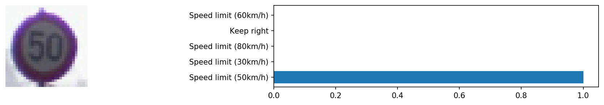

# **Traffic Sign Recognition** 

The goals / steps of this project are the following:
* Load the data set (see below for links to the project data set)
* Explore, summarize and visualize the data set
* Design, train and test a model architecture
* Use the model to make predictions on new images
* Analyze the softmax probabilities of the new images
* Summarize the results with a written report

## Rubric Points

### Here I will consider the [rubric points](https://review.udacity.com/#!/rubrics/481/view) individually and describe how I addressed each point in my implementation.  

---

### Files Submitted

#### 1. Submission Files

You're reading my writeup / README. And here is a link to my [project code](./Traffic_Sign_Classifier.ipynb)

### Data Set Summary & Exploration

#### 1. Dataset Summary

* The size of the training set is 34799
* The size of the validation set is 4410
* The size of the test set is 12630
* The shape of a traffic sign image is (32, 32, 3)
* The number of unique classes/labels in the data set is 43

#### 2. Exploratory Visualization

Here are a few images from the dataset:

Also, here is a bar chart showing the distribution of sign types in the training, validation, and testing data sets:

### Design and Test a Model Architecture

#### 1. Preprocessing

First, I converted images to grayscale using Y channel from YUV colorspace, hoping that such representation filters out some less relevant details of the images. Then, I normalized the data with zero mean and unit variance to ensure numerical stability.

There is certainly room for improvement in my image preprocessing pipeline. I could also try histogram equalization, for example. Generating additional data would probably help achieve better results too.

#### 2. Model Architecture

My final model consisted of the following layers:

| Layer           | Type            | Description |
| --------------- | --------------- | ----------- |
| input           | Input           | 32x32x1 preprocessed image |
| conv1           | Convolution 5x5 | 16 filters, 1x1 stride, valid padding |
| conv1_relu      | ReLU            | |
| conv1_pool      | Max pooling     | 2x2 stride, same padding |
| conv1_dropout   | Dropout         | rate=0.1 |
| conv2           | Convolution 5x5 | 32 filters, 1x1 stride, valid padding |
| conv2_relu      | ReLU            | |
| conv2_pool      | Max pooling     | 2x2 stride, same padding  |
| conv2_dropout   | Dropout         | rate=0.2 |
| conv3           | Convolution 5x5 | 64 filters, 1x1 stride, valid padding |
| conv3_relu      | ReLU            | |
| conv3_pool      | Max pooling     | 2x2 stride, same padding |
| conv3_dropout   | Dropout         | rate=0.3 |
| conv1_pool2     | Max pooling     | *input: conv1_pool*, 4x4 stride, same padding |
| branch1         | Flatten         | |
| conv2_pool2     | Max pooling     | *input: conv2_pool*, 2x2 stride, same padding |
| branch_2        | Flatten         | |
| branch_3        | Flatten         | *input: conv3_pool*
| concat          | Concatenate     | *branch1, branch2, branch3* |
| fc1             | Fully connected | 500 units |
| fc1_relu        | ReLU            | |
| fc1_dropout     | Dropout         | rate=0.5 |
| fc2             | Fully connected | n_classes (43) units |
| softmax         | Softmax         | |

#### 3. Model Training

I used an Adam optimizer so that manually tuning the learning rate wasn't necessary. I trained the model for 42 epochs with a batch size of 64.

#### 4. Solution Approach

My final model results were:
* training set accuracy of 0.9959
* validation set accuracy of 0.9621
* test set accuracy of 0.9552

I decided to start with something simple first, so I tried LeNeT-5 architecture and a preprocessing pipeline that consisted of just RGB grayscaling and normalization. With this approach, validation accuracy quickly rose over 0.70 but stopped improving somewhere in the 0.79-0.86 range.

Next, I tried to leverage transfer learning in Keras with some state-of-the-art image classification networks (ResNet50, ResNet50V2, MobileNet, MobileNetV2) with weights pre-trained on the ImageNet dataset. I replaced the final layers with my own fully connected layers, passed my data through each network's preprocessing pipeline, and flagged the pre-trained layers as non-trainable. To my surprise, this did not work out very well at all. The best accuracy on the validation set I could get this way was around 0.60. At the same time, the accuracy on the training data set was approaching 1.00, which suggested that the model was overfitting. No amount of dropout did help.

*Now that I wrote this though, I think I could also try transferring only the first several blocks of layers from these networks. Such layers would be responsible for lower-level feature extraction common to any image data. High-level features of the ImageNet data are probably not that relevant for traffic sign classification.*

Finally, I implemented a multi-scale convolutional architecture similar to the one described in [Traffic Sign Recognition with Multi-Scale Convolutional Networks](http://yann.lecun.com/exdb/publis/pdf/sermanet-ijcnn-11.pdf) by Pierre Sermanet and Yann LeCun. At first, I could not get past 0.90 on the validation set, no matter how I tweaked the model. Then, I modified my preprocessing pipeline to convert images to YUV, as suggested by paper. That is how I got past 0.93.

### Test a Model on New Images

#### 1. Acquiring New Images

Here are the German traffic signs that I screenshotted from Google Street View in Germany:

The sign on the 10th image might be particularly difficult to classify because it is situated unfavorably, implies recognizing digits, and overall does not look similar to the signs in the training data set. On the image 3, another sign partially covers the intended traffic sign. Image 4 has a more noisy background. Image 8 has a slightly warped perspective.

#### 2. Performance on New Images

Here are the results of the prediction:

| Image                                    | Prediction |
| ---------------------------------------- | ---------- |
| Turn left ahead                          | Turn left ahead |
| Road narrows on the right                | Road narrows on the right |
| Stop                                     | Stop |
| Go straight or right                     | Go straight or right |
| Vehicles over 3.5 metric tons prohibited | Vehicles over 3.5 metric tons prohibited |
| Keep right                               | Keep right |
| Speed limit (50km/h)                     | Speed limit (50km/h) |
| Priority road                            | Priority road |
| No passing                               | No passing |
| Speed limit (30km/h)                     | Speed limit (30km/h) |

The model was able to correctly guess 10/10 traffic signs, which gives an accuracy of 100%. This compares favorably to the accuracy on the test set of 95.52%.

#### 3. Model Certainty - Softmax Probabilities

The model is very confident of its predictions, as evidenced by top probabilities being close to 1.0.

